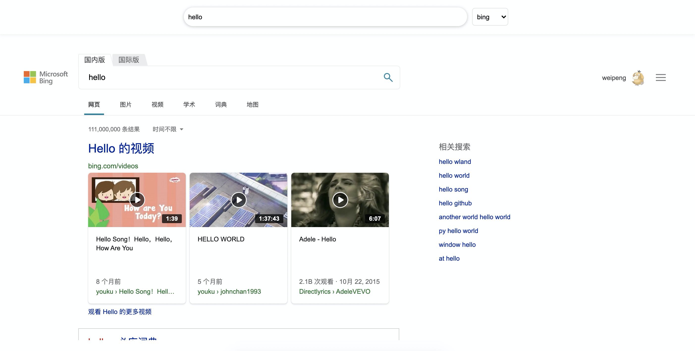

# F+ 
顾形思义，F#的精简版，是本人在2019-nCoV的时候无聊搞的一种船新的语言，全名Fpluslang。
语法糖简单优美深得我心。
```f#
// file: util.fp
// react like library
let log = window.console.log;
let alert = window.alert;

let rawTag = [
    "div";
    "span";
    "input";
    "button";
    "iframe";
    "select";
    "option"
];
let rawComponent = rawTag |> list.map fn x = {
  x,(documentHelper.createElement x);
};

let createElement component = {
  fn props = {
    fn children = {
      {
        "component", component;
        "props", props;
        "children", children
      };
    };
  };
}
let unstruct param = {
  param.component param.props (param.children |> list.map fn x = {
    if (typeof x) = "string" {
      x;
    } else {
      unstruct x;
    };
  });
}

let domRender dom,com = {
  let component,props,children = com;
  let publicRender,privateState = component();
  let ret = unstruct(publicRender props,children);
  documentHelper.append dom ret;
  dict.effectUpdate privateState,{"dom",ret};
}

let view domGen = {
   let ret () = {
     let state = {};
     let privateState = {"firstRender", true; "renderMap", {}; "props",{}; "dom",()};
     let helper = {"setState", fn x = {
         dict.effectUpdate state,x;
         let ret = unstruct (render());
         if privateState.dom {
          documentHelper.replaceWith privateState.dom,ret;
        };
         dict.effectUpdate privateState,{"dom",ret};
     }};
     let publicRender props,children = {
        dict.effectUpdate privateState,{"props",props};
        dict.effectUpdate privateState.props,{"children",children};
        render();
     }
     let render () = {
         let renderMap = privateState.renderMap;
         let pri = domGen privateState.props,state,helper;
         let diffAndUpdate x,y,z = {
            let isRawComponent = rawComponent |> list.exists fn x = { x.1 = z.component;};
            if isRawComponent {
                z;
            } else {
               let cache = renderMap.(string.from x + string.from y);
               if cache.component = z.component  {
                  let realChildren = z.children |> list.map fn child,idx = {
                     if (typeof child) = "string" {
                       child;
                     } else {
                       diffAndUpdate x,idx,child;
                     };
                  };
                  let ret = cache.render (z.props,realChildren);
                  ret;
               } else {
                  let pubRender,privateState = z.component();
                  let realChildren = z.children |> list.map fn child,idx = {
                     if (typeof child) = "string" {
                       child;
                     } else {
                       diffAndUpdate x,idx,child;
                     };
                  };
                  let ret = pubRender z.props,realChildren;
                  dict.effectUpdate renderMap,{(string.from x + string.from y),{"component", z.component;"render", pubRender}};
                  ret;
               };
            };
         };
         diffAndUpdate 0,0,pri;
     }
     publicRender,privateState;
   };
   createElement ret;
};

// 模块导出，最后一个表达式为导出对象
{
  (rawComponent |> list.map fn obj,index = {
    let x,y = obj;
    x,(view fn props = {
      createElement y props props.children;
    });
  }) + ["log",log;"alert",alert;"toView",view; "domRender",domRender]
};
```
```f#
// file: main.fp
// 模块引用
let log,alert,div,span,input,button,iframe,select,option,toView,domRender = import "./util.fp";

// 函数声明，lambda表达式
let search x = {
    [
        (string.concat "https://www.google.com/webhp?igu=1&q=" x),"c1";
        (string.concat "https://cn.bing.com/search?&q=" x),"c2";
        (string.concat "https://www.baidu.com/s?wd=" x),"c3"
    ]
        |> list.each fn x,y = {
              y |> documentHelper.getElementById |> documentHelper.setAttr "src",x;
          }
        |> ignore;
}

// 管道调用
let onclick () = {
    "searchinput"
        |> documentHelper.getElementById
        |> documentHelper.getProp "value"
        |> search
        |> ignore;
}

let getQuery () = {
    if window.location.search {
        window.location.search  |> string.replace "?q=","";
    } else {
        "";
    };
}

// 声明一个React like组件
let TopBox = toView fn props,state,helper = {
    div {
            "style","position:fixed;width:100%;box-shadow:0 2px 8px #f0f1f2;padding-bottom:1rem;padding-top:1rem;display: flex;justify-content: center;align-items: center;position: fixed;width: 100%;"
        } [
            input {
                "id","searchinput";
                "value", if window.location.search {getQuery();} else {"";}
            } [];
            select {"id", "selecter"; "style", "
                height: 36px;
                margin-right: 5px;
                margin-left: 10px;
            "} (props.options |> list.map fn x,y = {option {"value",x.0} [x.1];})
        ];
};

// 组建引用
let Main = toView fn props,state,helper = {
  div {} [
    TopBox {"options",[("google","谷歌");("bing","Bing");("baidu","百度")]} [];
    div {"style","display:inline-block;width:100%;margin-top:5rem"} [
      iframe {"id","c1";"style","border:none;width:100%;height:85vh"} []
    ];
    div {"style","display:inline-block;width:100%;"} [
      iframe {"id","c2";"style","border:none;width:100%;height:85vh;display:none"} []
    ];
    div {"style","display:inline-block;width:100%;"} [
      iframe {"id","c3";"style","border:none;width:100%;height:85vh;display:none"} []
    ]
  ];
};

let initDom () = {
  domRender (documentHelper.body,(Main {} []));
}

let initEvent () = {
    document.addEventListener "keyup",fn x = {
        if x.code = "Enter" {
            onclick();
        } |> ignore;
    };
  "selecter"
      |> documentHelper.getElementById
      |> documentHelper.addListener "change",fn x = {
          {
            "google",("c1", ["c2";"c3"]);
            "bing",("c2", ["c1";"c3"]);
            "baidu",("c3", ["c2";"c1"])
          }.(x.target.value)
          |> fn v1,v2 = {
                v1
                |> documentHelper.getElementById
                |> documentHelper.setAttr "style","border:none;width:100%;height:85vh;display:block";
                v2
                |> list.each fn x = {
                   x
                   |> documentHelper.getElementById
                   |> documentHelper.setAttr "style","border:none;width:100%;height:85vh;display:none";
                };
           };
        }
       |> ignore;
}

let autoSearch () = {
  if window.location.search {
    getQuery() |> search;
  } |> ignore;
}

// 函数组合
let start = initDom + initEvent + autoSearch;

start() |> ignore;
```

